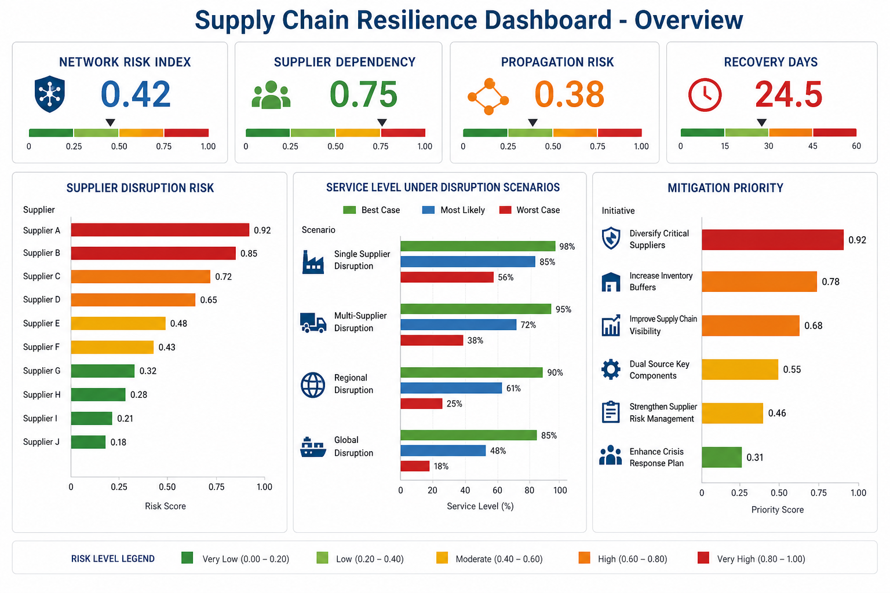
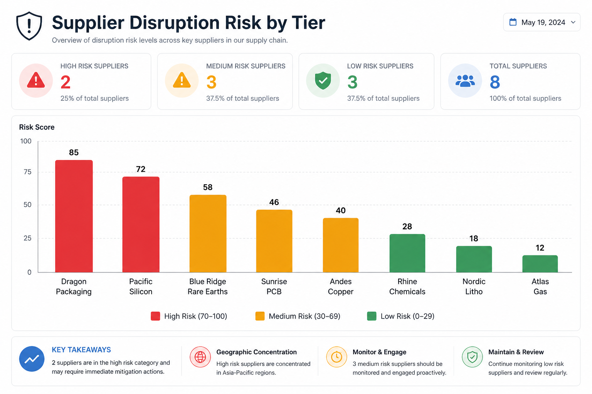
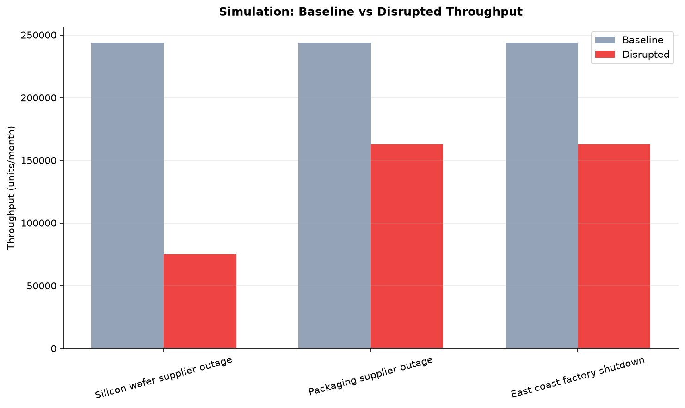
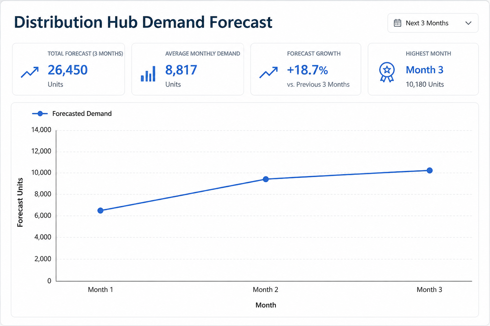
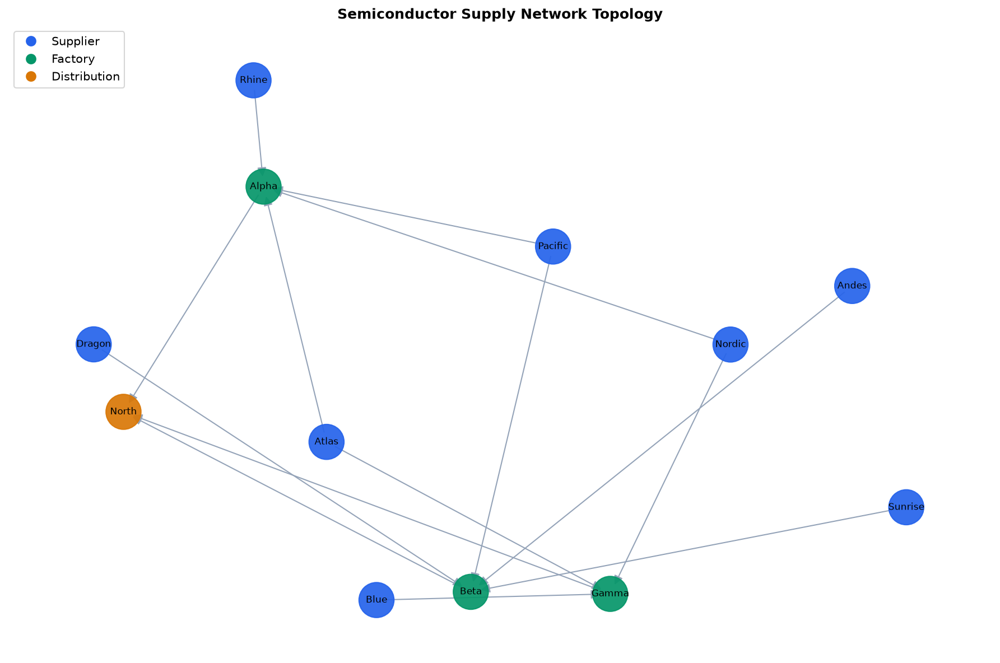

**Critical Supply Chain Resilience AI**

**Live Dashboard:** [https://critical-supply-chain-resilience-ai-by7jr2dvkuxue3doembshj.streamlit.app/](https://critical-supply-chain-resilience-ai-by7jr2dvkuxue3doembshj.streamlit.app/)  
Interactive prototype — no install required. User guide: [docs/dashboard-user-guide.md](docs/dashboard-user-guide.md)

---

**Overview**

Critical Supply Chain Resilience AI is an open research and engineering initiative aimed at developing advanced predictive analytics and optimization frameworks to strengthen the resilience of critical infrastructure manufacturing supply chains.

The project focuses on applying artificial intelligence, machine learning, and network optimization techniques to detect vulnerabilities, anticipate disruptions, and improve the stability and operational continuity of manufacturing systems essential to national security and economic stability.

The framework is designed to support industries whose disruptions can have major national and economic consequences, including:

- Semiconductors and advanced electronics
- Energy infrastructure systems
- Medical devices and healthcare manufacturing
- Transportation and aerospace equipment
- Defense-related manufacturing systems

**Motivation**

Modern manufacturing systems rely on highly interconnected global supply networks. While these networks enable efficiency and scalability, they also introduce vulnerabilities that can propagate disruptions across industries.

Recent global events—including pandemics, geopolitical conflicts, and semiconductor shortages—have demonstrated the need for data-driven approaches to supply chain resilience.

This project aims to develop AI-powered decision-support tools that help organizations, researchers, and policymakers identify risks, evaluate resilience strategies, and strengthen the stability of critical manufacturing supply chains.

**Project Objectives**

The primary objectives of this project are to:

- Develop predictive models capable of identifying early signals of supply chain disruptions.
- Design optimization algorithms that improve supply network resilience through supplier diversification and logistics planning.
- Simulate disruption scenarios to evaluate the impact of failures across supply chain networks.
- Create quantitative resilience metrics that measure vulnerability, risk propagation, and recovery capacity.

**Key Capabilities**

**Disruption Prediction**

Machine learning models analyze multiple data sources to detect early indicators of supply chain disruptions, including:

- Supplier performance trends
- Logistics delays
- Economic indicators
- Geopolitical risk signals

**Supply Network Optimization**

Optimization models help identify resilient supply network structures by balancing:

- Operational cost
- Redundancy
- Supplier diversification
- Transportation constraints

**Supply Chain Simulation**

Simulation tools enable organizations to evaluate what-if scenarios, such as:

- Factory shutdowns
- Transportation disruptions
- Trade restrictions
- Raw material shortages

These simulations help organizations prepare for potential supply chain shocks.

**Resilience Metrics**

The framework provides quantitative indicators such as:

- Supply chain risk index
- Supplier dependency scores
- Disruption propagation probability
- Recovery time estimation

These metrics support decision-makers in evaluating and improving supply chain resilience.

**Project Structure**

```
critical-supply-chain-resilience-ai
│
├── README.md
├── LICENSE
├── CONTRIBUTING.md
├── requirements.txt
├── requirements-planned.txt
│
├── dashboard
│   └── app.py
│
├── docs
│   ├── images
│   ├── dashboard-user-guide.md
│   ├── live-dashboard.md
│   ├── methodology.md
│   ├── policy-impact.md
│
├── data
│   ├── raw
│   ├── processed
│
├── models
│   ├── predictive_models
│   ├── optimization_models
│
├── src
│   ├── forecasting
│   │    ├── demand_forecast.py
│   │    ├── disruption_prediction.py
│   │
│   ├── optimization
│   │    ├── supply_network_optimizer.py
│   │    ├── logistics_optimizer.py
│   │
│   ├── simulation
│   │    ├── supply_chain_simulator.py
│   │
│   ├── resilience_metrics
│   │    ├── risk_index.py
│   │
│   ├── visualization
│   │    └── dashboard_charts.py
│   │
│   └── utils
│
├── notebooks
│   ├── semiconductor_case_study.ipynb
│   ├── energy_supply_chain_analysis.ipynb
│
└── examples
   ├── semiconductor_supply_chain_demo.py
   └── week1_network_overview.py
```

**How to Run the Prototype**

Follow these steps to set up and run the full decision-support prototype on your machine.

**Prerequisites**

- Python 3.10 or newer
- Git
- Internet access (to install packages)

**Step 1 — Clone the repository**

```bash
git clone https://github.com/ishimweruberamitwe125/critical-supply-chain-resilience-ai.git
cd critical-supply-chain-resilience-ai
```

**Step 2 — Create and activate a virtual environment**

Windows (PowerShell):

```powershell
python -m venv .venv
.venv\Scripts\activate
```

macOS / Linux:

```bash
python3 -m venv .venv
source .venv/bin/activate
```

**Step 3 — Install dependencies**

```bash
pip install --upgrade pip
pip install -r requirements.txt
```

**Step 4 — Prepare sample datasets**

```bash
python scripts/prepare_week1_data.py
python scripts/prepare_energy_data.py
```

**Step 5 — Run the command-line prototype demo**

```bash
python examples/semiconductor_supply_chain_demo.py
```

This runs the full pipeline: graph → metrics → prediction → simulation → optimization and prints a report in the terminal.

**Step 6 — Launch the live interactive dashboard**

**Option A — Open the public live app (recommended)**

**[Live Dashboard](https://critical-supply-chain-resilience-ai-by7jr2dvkuxue3doembshj.streamlit.app/)**

Step-by-step usage: [docs/dashboard-user-guide.md](docs/dashboard-user-guide.md)

**Option B — Run locally**

```bash
streamlit run streamlit_app.py
```

Your browser opens at `http://localhost:8501`. This is the **live dashboard** — charts are rebuilt from the analytics pipeline when you change industry or refresh data.

> **Note for reviewers:** PNG images in the README and PowerPoint are **static screenshots**. The [live dashboard](https://critical-supply-chain-resilience-ai-by7jr2dvkuxue3doembshj.streamlit.app/) is interactive and runs the same pipeline code. See [docs/live-dashboard.md](docs/live-dashboard.md) for deployment details.

**Step 7 — Open Jupyter case studies (optional)**

```bash
jupyter notebook notebooks/semiconductor_case_study.ipynb
jupyter notebook notebooks/energy_supply_chain_analysis.ipynb
```

**Step 8 — Run tests (optional)**

```bash
pytest tests/ -v
```

**Step 9 — Generate dashboard images and presentation (optional)**

```bash
python scripts/generate_all_assets.py
```

This creates PNG charts in `docs/images/` and regenerates the PowerPoint deck.

**Prototype Presentation (PowerPoint)**

Download the ready-to-use deck for researchers, companies, and grant audiences:

**[docs/presentations/Critical_Supply_Chain_Resilience_AI.pptx](docs/presentations/Critical_Supply_Chain_Resilience_AI.pptx)**

The presentation includes project overview, business value, architecture, dashboard screenshots, case studies, and collaboration next steps.

Regenerate after updating project content:

```bash
python scripts/generate_presentation.py
```

**Quick Reference**

| Goal | Command |
|------|---------|
| Terminal demo | `python examples/semiconductor_supply_chain_demo.py` |
| Web dashboard (live) | [Open live app](https://critical-supply-chain-resilience-ai-by7jr2dvkuxue3doembshj.streamlit.app/) |
| Dashboard user guide | [docs/dashboard-user-guide.md](docs/dashboard-user-guide.md) |
| Semiconductor notebook | `jupyter notebook notebooks/semiconductor_case_study.ipynb` |
| Energy notebook | `jupyter notebook notebooks/energy_supply_chain_analysis.ipynb` |
| Run tests | `pytest tests/ -v` |
| Generate slides | `python scripts/generate_presentation.py` |
| Download presentation | `docs/presentations/Critical_Supply_Chain_Resilience_AI.pptx` |
| Dashboard PNG charts | `python scripts/generate_dashboard_images.py` |

**How to Get Prototype Dashboard Images**

**Static vs live**

| Type | Description |
|------|-------------|
| **Live dashboard** | Interactive app — [open live URL](https://critical-supply-chain-resilience-ai-by7jr2dvkuxue3doembshj.streamlit.app/) or `streamlit run streamlit_app.py` |
| **User guide** | [docs/dashboard-user-guide.md](docs/dashboard-user-guide.md) — how to use each tab |
| **Public live URL** | [critical-supply-chain-resilience-ai-by7jr2dvkuxue3doembshj.streamlit.app](https://critical-supply-chain-resilience-ai-by7jr2dvkuxue3doembshj.streamlit.app/) |

**Reply to “Are the dashboard screenshots live?”**

> The README and slide images are static exports. The live prototype dashboard runs the same analytics pipeline interactively—you can switch industries, run what-if simulations, and refresh results in real time.

**Option A — View static PNGs already in the repo**

Open these PNG files locally or view them in the GitHub README (PNG is used because GitHub does not reliably render SVG in README files):

| File | Description |
|------|-------------|
| `docs/images/web_dashboard_preview.png` | Streamlit dashboard preview |
| `docs/images/dashboard_overview.png` | Executive KPI overview |
| `docs/images/supplier_risk_chart.png` | Supplier disruption risk |
| `docs/images/simulation_impact.png` | Baseline vs disrupted throughput |
| `docs/images/demand_forecast.png` | Distribution hub demand forecast |
| `docs/images/supply_network_graph.png` | Supply network topology |

**Option B — Regenerate PNG charts from live prototype data**

After completing Steps 1–4 above (venv, install, prepare data), run:

```bash
python scripts/generate_dashboard_images.py
```

This executes the full analytics pipeline and saves these PNG files:

- `docs/images/dashboard_overview.png`
- `docs/images/supplier_risk_chart.png`
- `docs/images/simulation_impact.png`
- `docs/images/demand_forecast.png`
- `docs/images/supply_network_graph.png`
- `docs/images/web_dashboard_preview.png`

**Option C — Use the live interactive dashboard**

```bash
streamlit run streamlit_app.py
```

Or on Windows:

```powershell
.\scripts\run_live_dashboard.ps1
```

Select **Semiconductor** or **Energy Infrastructure** in the sidebar. The dashboard renders interactive Plotly charts for risk, simulation, mitigations, network map, and forecast.

**Option D — Generate charts inside Jupyter**

Open either case study notebook and run the final cell:

```bash
jupyter notebook notebooks/semiconductor_case_study.ipynb
```

The notebook cell calling `save_dashboard_images()` writes PNG files to `docs/images/`.

**Option E — Generate dashboard images and grant presentation together**

```bash
python scripts/generate_all_assets.py
```

This runs the dashboard image generator and creates `docs/presentations/Critical_Supply_Chain_Resilience_AI.pptx`.

**Dashboard Gallery**

Visual outputs from the prototype decision-support platform.

**Web Dashboard (Streamlit + Plotly)**


**Executive Overview**



**Supplier Disruption Risk**



**Disruption Simulation Impact**



**Demand Forecast**



**Supply Network Topology**



**Prototype Scope vs Planned Scope**

This repository contains a **working research prototype**, not the full production system described in the long-term project vision. The table below clarifies what is implemented today versus what remains on the roadmap.

| Area | Implemented now | Planned |
|------|----------------|---------|
| Supply network graph model | Yes — NetworkX graphs from CSV | Live ERP/logistics ingestion |
| Resilience metrics | Yes — risk index, dependency, propagation, recovery | Calibrated enterprise metrics |
| Disruption simulation | Yes — supplier outages, factory shutdowns | Multi-period and trade-policy scenarios |
| Disruption prediction | Prototype — sklearn on synthetic supplier features | PyTorch models on historical disruption data |
| Demand forecasting | Prototype — baseline hub-capacity forecast | Time-series models with external signals |
| Network optimization | Prototype — heuristic mitigation ranking | Google OR-Tools constrained optimization |
| Case studies | Semiconductor and energy notebooks | Medical, aerospace, defense networks |
| Dashboards and reporting | CLI, Streamlit, Jupyter, PowerPoint generator | Production API and digital twin integration |
| Trained model artifacts | Not yet — folders reserved under `models/` | Saved predictive and optimization models |
| External data sources | Synthetic CSV benchmarks only | Economic indicators and live logistics feeds |

**Technologies Used**

**Implemented in the prototype**

- Python
- Pandas and NumPy
- NetworkX
- Scikit-learn
- Matplotlib
- Plotly
- Streamlit
- Jupyter Notebooks
- python-pptx
- pytest

**Planned (documented, not yet integrated)**

- PyTorch — deep learning for advanced prediction
- Google OR-Tools — mathematical optimization for supplier and routing decisions

Optional planned dependencies are listed in `requirements-planned.txt`.

**Example Applications**

**Semiconductor Supply Chains** *(implemented)*

Analyze supplier dependencies and simulate disruptions affecting semiconductor fabrication networks.

**Energy Infrastructure Equipment** *(implemented)*

Evaluate alternative supplier configurations for critical energy infrastructure components.

**Medical Device Manufacturing** *(planned)*

Identify supply chain vulnerabilities affecting healthcare equipment production.

**Transportation, Aerospace, and Defense Manufacturing** *(planned)*

Extend the framework to additional critical manufacturing sectors described in the project vision.

**Policy and Strategic Impact**

Improving the resilience of critical manufacturing supply chains is essential for:

- National security
- Economic stability
- Technological competitiveness
- Public health preparedness

This project contributes to ongoing efforts to strengthen critical infrastructure systems through data-driven analytics and AI-driven decision support tools.

**Future Research Directions**

Future development areas include:

- Supply chain digital twins
- Reinforcement learning for adaptive logistics optimization
- Multi-agent supply chain coordination systems
- Integration with real-time logistics data streams

**Contributing**

Contributions from researchers, engineers, and practitioners interested in AI, supply chain analytics, and infrastructure resilience are welcome.

**License**

See [LICENSE](LICENSE) for details.

**Author**

**David Ishimwe Ruberamitwe**

Researcher focused on artificial intelligence applications for resilient infrastructure systems and manufacturing supply chains.

Research interests include:

- AI for supply chain resilience
- Critical infrastructure analytics
- Predictive logistics systems
- Resilient manufacturing networks
