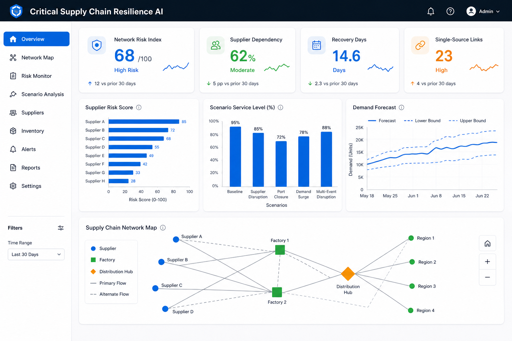
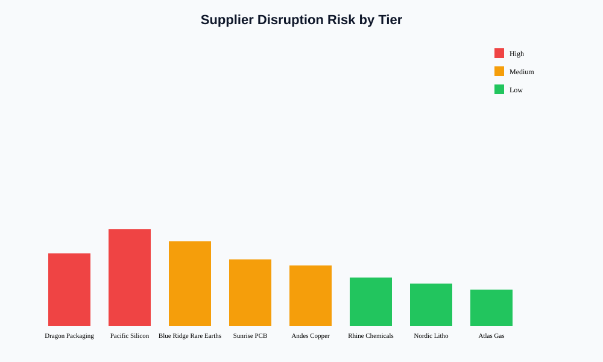
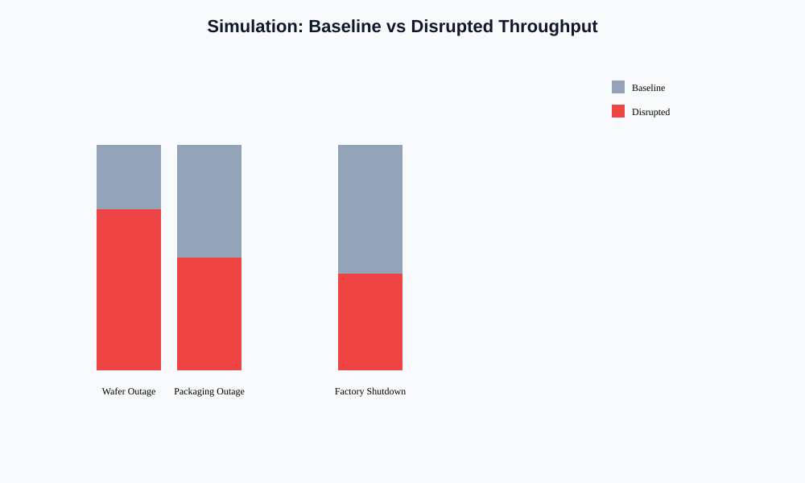
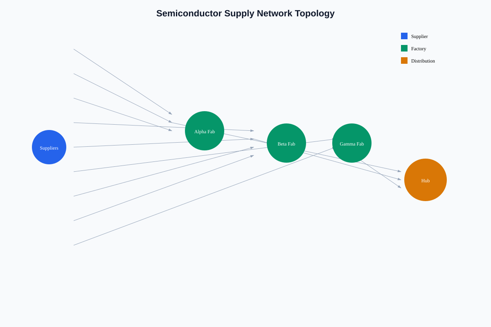

**Critical Supply Chain Resilience AI**

---

**Overview**

Critical Supply Chain Resilience AI is an open research and engineering initiative aimed at developing advanced predictive analytics and optimization frameworks to strengthen the resilience of critical infrastructure manufacturing supply chains.

The project focuses on applying artificial intelligence, machine learning, and network optimization techniques to detect vulnerabilities, anticipate disruptions, and improve the stability and operational continuity of manufacturing systems essential to national security and economic stability.

The framework is designed to support industries whose disruptions can have major national and economic consequences, including:

- Semiconductors and advanced electronics
- Energy infrastructure systems
- Medical devices and healthcare manufacturing
- Transportation and aerospace equipment
- Defense-related manufacturing systems

**Motivation**

Modern manufacturing systems rely on highly interconnected global supply networks. While these networks enable efficiency and scalability, they also introduce vulnerabilities that can propagate disruptions across industries.

Recent global events—including pandemics, geopolitical conflicts, and semiconductor shortages—have demonstrated the need for data-driven approaches to supply chain resilience.

This project aims to develop AI-powered decision-support tools that help organizations, researchers, and policymakers identify risks, evaluate resilience strategies, and strengthen the stability of critical manufacturing supply chains.

**Project Objectives**

The primary objectives of this project are to:

- Develop predictive models capable of identifying early signals of supply chain disruptions.
- Design optimization algorithms that improve supply network resilience through supplier diversification and logistics planning.
- Simulate disruption scenarios to evaluate the impact of failures across supply chain networks.
- Create quantitative resilience metrics that measure vulnerability, risk propagation, and recovery capacity.

**Key Capabilities**

**Disruption Prediction**

Machine learning models analyze multiple data sources to detect early indicators of supply chain disruptions, including:

- Supplier performance trends
- Logistics delays
- Economic indicators
- Geopolitical risk signals

**Supply Network Optimization**

Optimization models help identify resilient supply network structures by balancing:

- Operational cost
- Redundancy
- Supplier diversification
- Transportation constraints

**Supply Chain Simulation**

Simulation tools enable organizations to evaluate what-if scenarios, such as:

- Factory shutdowns
- Transportation disruptions
- Trade restrictions
- Raw material shortages

These simulations help organizations prepare for potential supply chain shocks.

**Resilience Metrics**

The framework provides quantitative indicators such as:

- Supply chain risk index
- Supplier dependency scores
- Disruption propagation probability
- Recovery time estimation

These metrics support decision-makers in evaluating and improving supply chain resilience.

**Project Structure**

```
critical-supply-chain-resilience-ai
│
├── README.md
├── LICENSE
├── CONTRIBUTING.md
├── requirements.txt
│
├── dashboard
│   └── app.py
│
├── docs
│   ├── images
│   ├── architecture.md
│   ├── methodology.md
│   ├── policy-impact.md
│
├── data
│   ├── raw
│   ├── processed
│
├── models
│   ├── predictive_models
│   ├── optimization_models
│
├── src
│   ├── forecasting
│   │    ├── demand_forecast.py
│   │    ├── disruption_prediction.py
│   │
│   ├── optimization
│   │    ├── supply_network_optimizer.py
│   │    ├── logistics_optimizer.py
│   │
│   ├── simulation
│   │    ├── supply_chain_simulator.py
│   │
│   ├── resilience_metrics
│   │    ├── risk_index.py
│   │
│   ├── visualization
│   │    └── dashboard_charts.py
│   │
│   └── utils
│
├── notebooks
│   ├── semiconductor_case_study.ipynb
│   ├── energy_supply_chain_analysis.ipynb
│
└── examples
   ├── semiconductor_supply_chain_demo.py
   └── week1_network_overview.py
```

**Prototype Demo**

The repository includes a working prototype pipeline for the semiconductor case study:

```bash
python examples/semiconductor_supply_chain_demo.py
```

**Web Dashboard**

Launch the interactive Streamlit dashboard with **Plotly charts** and an industry selector (Semiconductor / Energy):

```bash
streamlit run dashboard/app.py
```



**Jupyter Case Studies**

```bash
jupyter notebook notebooks/semiconductor_case_study.ipynb
jupyter notebook notebooks/energy_supply_chain_analysis.ipynb
```

**Grant & Research Presentation**

Generate a PowerPoint deck with dashboard visuals for researchers and funders:

```bash
python scripts/generate_all_assets.py
```

Output: `docs/presentations/Critical_Supply_Chain_Resilience_AI.pptx`

**Dashboard Images**

Static charts for docs and presentations live in `docs/images/`. Regenerate PNGs from live pipeline data:

```bash
python scripts/generate_dashboard_images.py
```

| Dashboard | Preview |
|-----------|---------|
| Executive Overview |  |
| Supplier Risk |  |
| Simulation Impact |  |
| Network Topology |  |

**Technologies Used**

The project uses modern data science and optimization tools, including:

- Python
- Scikit-learn
- PyTorch
- Pandas and NumPy
- NetworkX
- Google OR-Tools
- Jupyter Notebooks
- Streamlit
- Plotly
- python-pptx

**Example Applications**

**Semiconductor Supply Chains**

Analyze supplier dependencies and simulate disruptions affecting semiconductor fabrication networks.

**Energy Infrastructure Equipment**

Evaluate alternative supplier configurations for critical energy infrastructure components.

**Medical Device Manufacturing**

Identify supply chain vulnerabilities affecting healthcare equipment production.

**Policy and Strategic Impact**

Improving the resilience of critical manufacturing supply chains is essential for:

- National security
- Economic stability
- Technological competitiveness
- Public health preparedness

This project contributes to ongoing efforts to strengthen critical infrastructure systems through data-driven analytics and AI-driven decision support tools.

**Future Research Directions**

Future development areas include:

- Supply chain digital twins
- Reinforcement learning for adaptive logistics optimization
- Multi-agent supply chain coordination systems
- Integration with real-time logistics data streams

**Contributing**

Contributions from researchers, engineers, and practitioners interested in AI, supply chain analytics, and infrastructure resilience are welcome.

**License**

See [LICENSE](LICENSE) for details.

**Author**

**David Ishimwe Ruberamitwe**

Researcher focused on artificial intelligence applications for resilient infrastructure systems and manufacturing supply chains.

Research interests include:

- AI for supply chain resilience
- Critical infrastructure analytics
- Predictive logistics systems
- Resilient manufacturing networks
